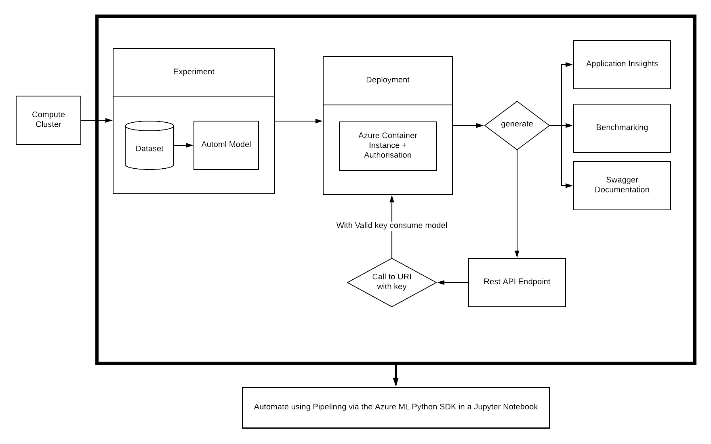

# MLOps-Azure

## Project Overview
I was working with the Bank-Marketing dataset, that contains information about a previous bank marketing campaign from a Portuguese institution, i.e. attributed of the people the campaign dealt with and if a client will subscribe to a term deposit product (which is a binary outcome).
We seek to predict that outcome. This can be helpful in developing future marketing campaigns.
The best model, was the VotingEnsemble that had an accuracy of 91.806%. Furthmore, we deployed the model, and consume it through a REST endpoint. Therby, we publish our pipeline of steps, automating the whole procedure.

## Architecture Diagram
Following flow diagram depicts the process.

This entire process can be seen as :
* [Authentication](#auth)
* [Automated ML Experiment](#automl)
* [Deploy the best model](#deploy)
* [Enable logging](#logging)
* [Swagger Documentation](#swagger)
* [Consume model endpoints](#consume)
* [Create and publish a pipeline](#pipeline)

## Future Improvements
* One can work with diferent datapoints, and visualise and benchmark the performance while actually using Application Insights.
* We may focus more time on exploring the data generating a more random dataset. The following columns have a broad gap in terms of number of instances:
    * There are far more married people than single and divorced.
    * There are far more people without a loan than with one.
    * The campaign maybe spread across the year for a better understanding of the customer's mood according to time of the year.
*Better data is bound to yield better results.*
* We can observe and generate a report on, to what extent does which factor affect the likeliness of a client to subscribe, and develop marketing campaigns around them.
* The AutoML experiment could also be run for a longer while which might as well fetch more effective models.
* Different parameters can be used in AutoML config in order to make more effective models.

## The Process in Practice

#### Authentication 
Skipped this section, since I used the provided labs.

#### Automated ML Experiment
Used the *Bank-Marketing* dataset for the task.

And completed the AutoML ecperiment

The best model was the Voting ensemble

#### Deploy the Best Model
Deploy the model as an endpoint. Use an Azure Container Instance for the same, with authentication enabled.

#### Enable Application Insights
The logs look as follows (post running `logs.py`).

The application insights URL in the bottom opens the applications, that are enabled while logging.

#### Swagger Documentation
Pull the latest swagger-ui docker image and to run it on port 80.

Expose swagger.json to a local HTTP server and run it in the swagger-ui.

#### Consume Model Endpoints
Entered Scoring URI and primary key in `endpoint.py` and run it.

#### Create, Publish and Consume a Pipeline
Completed the pipeline run.

And created the pipeline endpoint.

Following is how the pipeline looks like in the studio, with automl module and bank marketing dataset.

Thereby, the pipeline is published and is also active as diaplayed in the screenshot below.

 
#### YouTube Video Link - https://youtu.be/_AdKiVzcvh8
