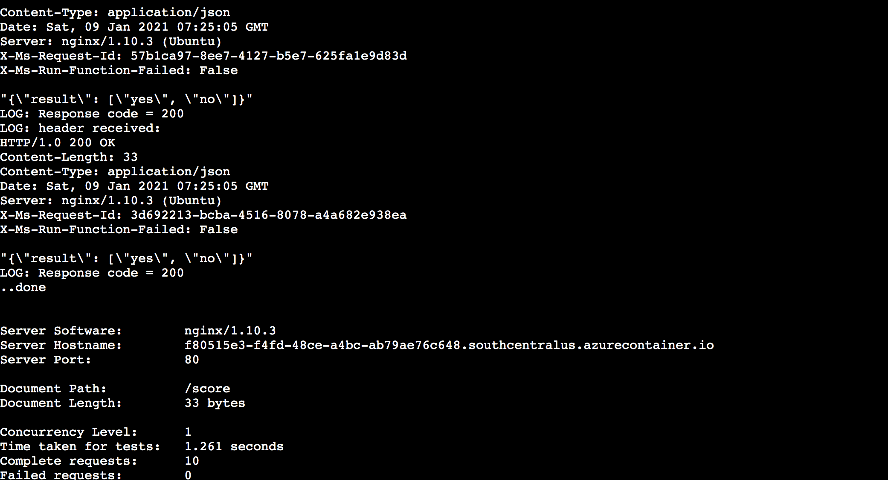

# MLOps-Azure

## Project Overview
I was working with the Bank-Marketing dataset, that contains information about a previous bank marketing campaign from a Portuguese institution, i.e. attributed of the people the campaign dealt with and <ins>if a client will subscribe to a term deposit product (which is a binary outcome)</ins>.
We seek to predict that outcome. This can be helpful in developing future marketing campaigns.
The best model, was the **VotingEnsemble** that had an accuracy of **91.806%**. Furthermore, we deployed the model, and consumed it through a REST endpoint. Thereby, we published our pipeline of steps, automating the whole procedure.

Following flow diagram depicts the process.

# Table of Contents
 * [Architecture Diagram](#arch)
 * [Future Improvements](#fi)
 * [The Process in Practice](#tpip)
     * [Authentication](#auth)
     * [Automated ML Experiment](#automl)
     * [Deploy the best model](#deploy)
     * [Enable logging](#logging)
     * [Swagger Documentation](#swagger)
     * [Consume model endpoints](#consume)
     * [Create and publish a pipeline](#pipeline)
 * [Screen Recording](#sr)
 * [Standout Suggestions](#ss)
 
 
## Architecture Diagram
Following is the architecture diagram to depict our approach and organisation.

## Future Improvements
* One can work with diferent datapoints, and visualise and benchmark the performance while actually using Application Insights.
* We may focus more time on exploring the data generating a more random dataset. The following columns have a broad gap in terms of number of instances:
    * There are far more married people than single and divorced.
    * There are far more people without a loan than with one.
    * The campaign maybe spread across the year for a better understanding of the customer's mood according to time of the year.
*Better data is bound to yield better results.*
* We can observe and generate a report on, to what extent does which factor affect the likeliness of a client to subscribe, and develop marketing campaigns around them.
* The AutoML experiment could also be run for a longer while which might as well fetch more effective models.
* Different parameters can be used in AutoML config in order to make more effective models.

## The Process in Practice

#### Authentication 
Skipped this section, since I used the provided labs.

#### Automated ML Experiment
We have been provided with the *Bank-Marketing* dataset for the task, visible as follows.

We created the appropriate compute required for running an automl run on our dataset. Furthermore, we created an automl run for the same, which completed as follows.

The best model was found out to be the Voting Ensemble with an accuracy of 91.806%

#### Deploy the Best Model
We choose the best model for deployment and enable "Authentication" while deploying the model using Azure Container Instance (ACI).

#### Enable Application Insights
We performing loggin on our endpoint, by running `logs.py`.

The executed code in logs.py enables Application Insights. "Application Insights enabled" is disabled before executing logs.py.

The application insights URL in the bottom opens of the above screenshot opens as follows. Notice the insihts generated, for the calls we made while testing.

#### Swagger Documentation
In order to view the swagger documentation provided by Microsoft Azure, for our endpoint in an appealing and understandable way we required the swagger-ui. I pulled the latest swagger-ui docker image and to run it on port 80.

To view our own documentation, I downloaded the swagger.json file and exposed it to a local HTTP server. This can now be run on the swagger-ui.

The API methods are:

#### Consume Model Endpoints
Now that we have implemented and understood our endpoint, we may consume it. This is done by passing appropriate ingormation to the endpoint using the `endpoint.py` file. We entered Scoring URI and primary key in `endpoint.py` in order to run it. The output is as follows:

I also performd *benchmarking*. This will help us create a baseline or acceptable performance measure. We used the Apache Benchmark for the same. I added the endpoint URI and Primary Key in the `benchmarking.sh` file, & received results as follows by running it:

#### Create, Publish and Consume a Pipeline
With the help of the `aml-pipelines-with-automated-machine-learning-step.ipynb` file, we made the pipeline Run. The RunDetails widget in our Jupyter Notebook, displays the Run Output as follows:

Following is how the Pipeline Run looks like in the studio, with automl module and bank marketing dataset.

It got completed successfuly, as follows.

Furthermore we also successfully published the Pipeline Endpoint.

This is how the Pipeline(s) appear in our experiments:

Thereby, the pipeline is published and is also active as displayed in the screenshot below.

## Screen Recording
<a href="https://youtu.be/bspUtA2201g">YouTube Video Link</a> contains the Working deployed ML model endpoint, Deployed Pipeline, Available AutoML Model, 
Successful API requests to the endpoint with a JSON payload et cetera in a screen recording.

## Standout Suggestions
I was redoing the experiment when I realised that, this time the AutoML run found **StackEnsemble** to be the best performing model, with an accuracy of 91.624%. This is marginally lesser than the accuracy I got with the *VotingEnsemble* previously i.e. 91.806%. Furthermore in this run, the VotingEnsemble had an accuracy of 91.563% which is actually quite close to the StackEnsemble. This indicates the requirement a more thorough look and longer run. As we know, AutoML is a tool to help data scientists, the output of this tool might become more effective or give a greater understanding with a deeper look and some more fine-tuning.

 

